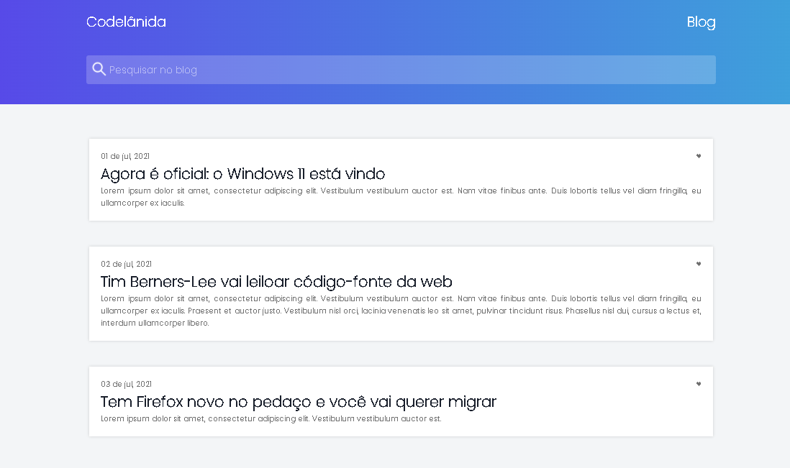
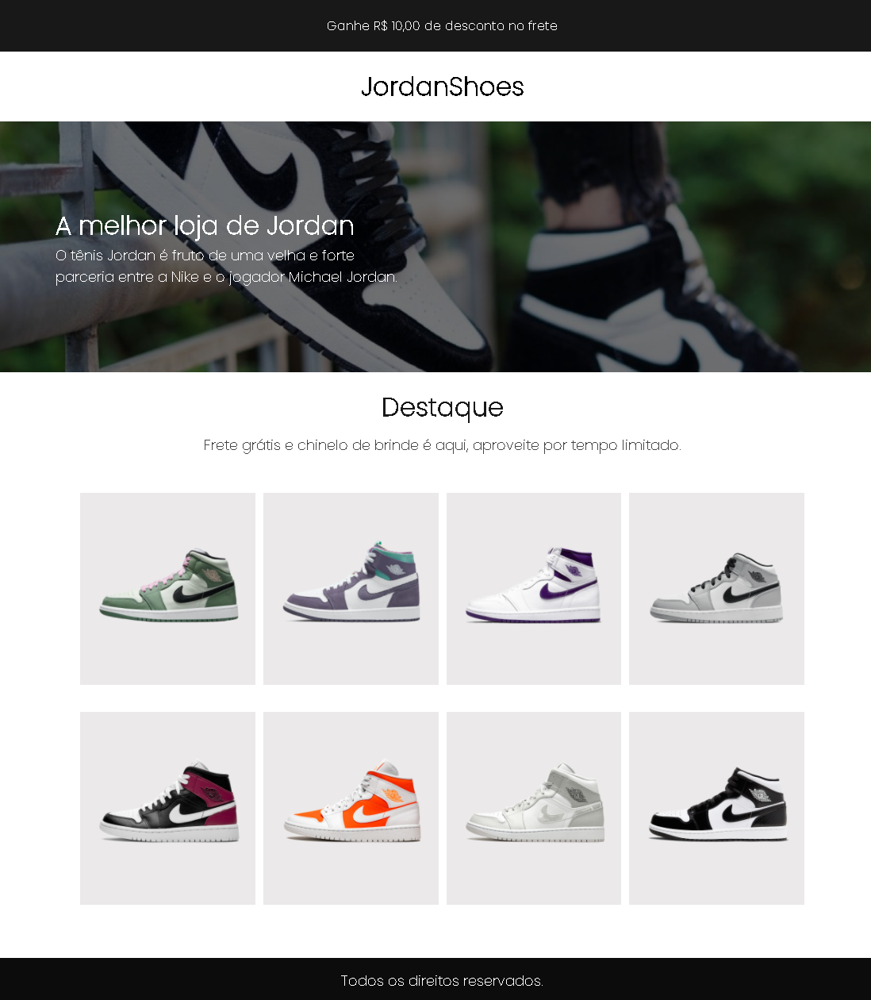

 

# Desafios IuriCode 💻

 

## 📌 Sobre

### 🥇 Bem vindo Dev, aqui estarei colocando o resultado de todos os desafios propostos por <a href="https://www.linkedin.com/in/iuricode/" target="_blank">IuriCode</a>. No qual ele fornece o layout projetado no Figma e permite a divulgação do resultado.

 

 

# 🎯 Projetos que foram e serão realizados. 

 
 

## ✨ Desafio 1 - IuriCode (Blog de Notícias) 💻
 

 
 

### Status: Concluído ✅
### 🧐 Confira o resultado <a href="https://blog-desafio1.netlify.app" target="_blank">aqui</a> 🧐
-----------------------------------------------------------------------------------------
 
 

## ✨ Desafio 2 - IuriCode (JordanShoes) 💻
 

 
 

### Status: Concluído ✅
### 🧐 Confira o resultado <a href="https://jordanshoes-desafio2.netlify.app" target="_blank">aqui</a> 🧐
-----------------------------------------------------------------------------------------
 
 
